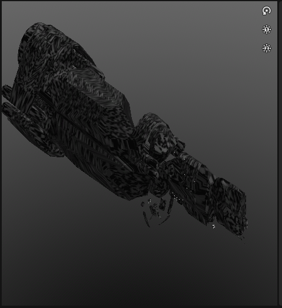
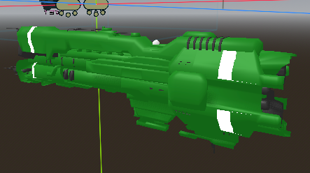

  

# Alien Diplomacy

**VR space strategy meets AI diplomacy** — fight massive boid swarms or talk your way out. Built for **Godot 4.6** with **OpenXR** (Meta Quest 3S) and **local LLM** dialogue.

  

#### Eduard and César · Autonomous Agents CA

  

---

  

### Table of Contents

  

- [Summary](#summary)

- [Progress so far](#progress-so-far)

- [Future plans](#future-plans)

- [Getting started](#getting-started)

  

---

  

## Summary

  

Starting off, the player can walk around a Solar System in the Galaxy, walking alongside

the planets and stars. An enemy mothership arrives and starts spawning a boid-based

storm of smaller attack-aircraft that are attacking your planets.

  

You as the player can see these boids flying around the planets, attacking them, and

then eventually fly back to the mothership to refuel, and then back out again to attack.

  

You as the player have 2 ways of proceeding.

  

### Attack back - fire-with-fire, boids-with-boids

  

You can then spawn your own mothership which can create boids of your own to shoot

down the attacker’s boids and eventually the mothership. Watching the battle rage on

and hope you have enough boids to win the fight.

  

### Diplomacy – Talk One-on-One

  

The Alien commander is open to talks. You can talk with the commander via hologram,

and using LLM, the commander can either be:

  

- Convinced to stand down (Good ending)

- Nuke himself which then destroys all surrounding planets (Bad ending)

- Annoy him and watch him spawn more boids to attack (Higher difficulty)

  

---

  

### Highlights

  

-  **Up to ~210,000 boids** (so far) on PC and **~10,000 on Meta Quest 3S** (so far) via ECS + GPU instancing ([MultiMesh](https://docs.godotengine.org/en/stable/classes/class_multimeshinstance3d.html))

-  **Custom procedural planets** — Using noise textures (Perlin, Simplex, and Cellular) with threshold-based colours *(oceans, islands, mountains, gas giants, moons, etc...)*

-  **Local LLM diplomacy** — talk to the alien commander in-game with Gemma 2 and NobodyWho; Speech-to-Text planned for later

-  **Tunable performance** — configurable physics tick rate and optional TPAA *(Temporal Physics Anti-Aliasing)* or aka **"offbrand physics DLSS"** for smooth GPU instance Buffer updating.

-  **One-Click setup** — scripts download addons and GGUF models in parallel; no manual plugin or model installs

  

---

  

# Overview

  

## Boids

  

Boids in this project are rendered using an **ECS-style** layout and [MultiMeshInstance3D](https://docs.godotengine.org/en/stable/classes/class_multimeshinstance3d.html) for **GPU instancing**

That let's us reach **~220,000 boids** on an average PC and **~10,000** on the Meta Quest 3S. When combined with the LLM the boids are reduced down to 4,000 to keep acceptable performance.

Physics tick rate runs the buffer updating and an optional double-buffer mode ***("offbrand physics DLSS")*** are used so we get extra smoothness on MultiMesh3D updating.

.png "Boids screenshot 1")
.png "Boids screenshot 2")
.png "Boids screenshot 3")
.png "Boids screenshot 4")

All boids will target different planets and swarm them.

### Motherships
Both Friendlies and Enemies have a **Mothership** which our boids spawn from.
These motherships wander the solar system, using avoidance steering to avoid colliding into planets. 

#### Enemy Mothership

The enemy mothership will float to the border regions of the solar system, avoiding all of the planets and friendlys, keeping to the outside always.

#### Friendly Mothership
The friendly mothership will always try to be close to the planets. It will steer to avoid the planets aswell but will make sure to stay close to the action!

### Factions

Boids can all be part of different factions, via a `PackedByteArray`. All bytes are treated like a signed 8-bit integer, giving us a range from -127 to +128:

-  **0** means the Boid is inactive / destroyed

-  **1 -> 128** means the Boid is friendly, and they have anywhere from 1-127 units of health left

-  **-1 -> -127** means the boid is hostile, their health works the same way.

We can implement unique 2N factions using this logic

  

## Planets

  

Planets are rendered with a custom GDShader that samples a noise texture in stages.

First it will pick a point in the noise texture and see what threshold it lies in. Custom colours are then applied to that threshold, letting us do islands on oceans, then mountains on those islands, as all colouring is done from the input noise.

We used a combination of **Perlin**, **Simplex**, and **Cellular** noise to achieve different looks (e.g. Earth-like, Sun-like).

  

## LLM

  

We use the [NobodyWho](https://github.com/nobodywho-ooo/nobodywho) plugin so the in-game LLM runs locally. You can already have a text conversation with the model from the chat UI. We're working on **Speech-to-Text** so you can speak to the alien commander at runtime (e.g. via the Quest microphone) instead of typing.

  

  

## Easy Setup

  

Custom setup scripts mean you don’t have to manually download LLM models or Godot plugins:

  

-  **Windows:** run `Setup.bat` from the repo root.

-  **Linux / macOS:** run `Setup/Setup.py` with [Python 3](https://www.python.org/downloads/).

  

Downloads run **in parallel** (3 items at once), then files are copied into the right folders and temporary files are removed. A log is written to `Setup/Setup attempt.log`.

  
  

# Original Plans *(Febuary)*

  

## Enemy Commander

  

### LLM Speech and response

  

The enemy commander will be able to be contacted at any point during the demo. When

talking to him, the player will use the microphone built-in to the Meta Quest 3s to record

their speech.

  

The recorded speech will then go through Speech-to-text. This text will then go through

a local LLM *(or API call to an external one if RAM is too low)* for a unique response and

whether the given speech was:

  

- Diplomatic *(calm-down the commander, move closer to good ending)*

- Aggressive / Threatening *(Antagonise the commander, move closer to bad / nuclear option)*

- Jokey / demeaning / Silly *(Annoy the commander and cause more boids to spawn, or make current enemy boids more aggressive)*

  

Whatever speech type was given will contribute to a hidden score to determine what

ending to give. The commanders’ response will be generated in text form and sent back

to the user. An audio feedback in “Alien language” *(Pseudo-Random noise)* will be

generated and it’s duration will be based on the length of the text response. The text will

be the “Subtitles” for the commanders response.

  

### Mesh

  

The command is an alien and can be contacted via hologram, so we’ll be going for a

**“Davey-Jones looking individual”**. Animated tentacles and particle effects will be added.

  
  
  

## Enemy

  

Enemy boids will have planets as their target.

  

They’ll first choose a point away from the planet and move there.

  

Then they’ll approach the planet so that they have a straight line of fire at the planet and

can perform a Strafing-Run attack.

  

Any Friendly boids that are encountered directly in-front of them will be shot and have

damage be applied to them.

  

When enemy boids have run out of ammo, their target will change to the mother ship so

that they can go back, slow down and refuel, and then head back to the targeted planet.

  

#### Friendly

  

Friendly boids will have the planets as their targets but will constantly over-shoot and

loop back around, thus circling around the planets.

  

Any enemy boids directly in front of friendly boids will also be shot and have damage

applied to them.

---

# Getting started

  

1.  **Clone the repo** using `git clone https://github.com/marc-rene/Alien-Diplomacy.git`

2. -  **Windows:** double-click `Setup.bat`.
	-  **Linux / macOS:**  Run the command `python3 Alien-Diplomacy/Setup/Setup.py`.

3. Once your headset is connected and ADB is running, run `Godot/copy_model.ps1` using an Administrator Terminal Session. This will copy the LLM model to the headset.

4.  Open the `project.godot` in **Godot**

  

The setup script downloads the two GGUF models and the NobodyWho addon into the right places. If you prefer to download manually, use:

  

- [gemma-2-2b-it-Q4_K_M.gguf](https://huggingface.co/bartowski/gemma-2-2b-it-GGUF/blob/main/gemma-2-2b-it-Q4_K_M.gguf) → place in `Godot/`

- [user-bge-m3-q8_0.gguf](https://huggingface.co/alela32/USER-bge-m3-Q8_0-GGUF/blob/main/user-bge-m3-q8_0.gguf) → place in `Godot/`

- [NobodyWho Godot addon](https://github.com/nobodywho-ooo/nobodywho/releases) → extract into `Godot/addons/`

# What we learned
## Eduard
Working with a local LLM in Godot is an absolute pain. Godot VR taught me that GEMMA needs very deliberate prompting to work as intended. Overly complex conditional instructions are ignored or just cause issues. Having a more direct commanding prompt makes it respond more reliably.

The most time consuming part was getting the LLM to work on the Meta Quest 3S. File paths were an absolute mess to work with while also requiring ADB to push files to get everything working as intended. Also making sure the release build was used instead of the debug build would be the main reason if the APK would run on the headset. 

On top of that, getting the AI responses to actually trigger game events required building a token accumulation system from scratch, the response finished signal doesn't reliably carry the full text, so every token had to be caught and stored manually. Speech to text was originally the intended input method, making the diplomacy feel a lot more natural and immersive, but it had to be scrapped entirely.

Permissions on the Quest 3S turned out to be a nightmare, getting the correct permissions declared, granted at runtime and this was a rabbit hole that ate significant time with nothing to show for it, so a virtual keyboard was built instead. 
For the alien voice I used Godot's AudioStreamGenerator to push raw sine wave frames in real time during generation, modulating the frequency and wobble based on keyword detection in the response so the character actually sounds different when it's angry versus when it's accepting a deal,all without a single audio asset. 

Getting the chat UI into VR space meant routing signals through Godot's group system since a Viewport2Din3D sub viewport is isolated from the main scene tree, so a direct signal connection simply doesn't reach the boids.
## César
Using Multmeshes and adopting an ECS style approach was definetly different. Many of the workflows with other Boids couldn't be adopted 1-to-1 and had to be changed. 

Originally I was going to have bolts and cannons but with multmeshes this proved to be too janky.
